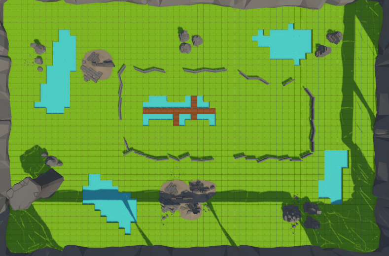
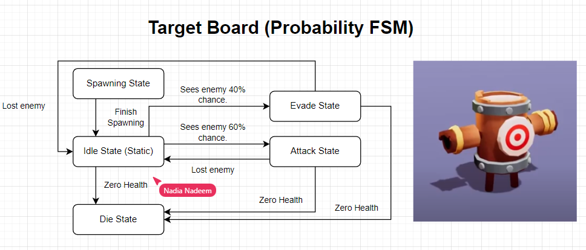
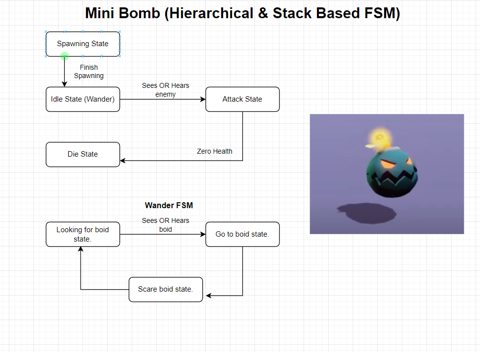
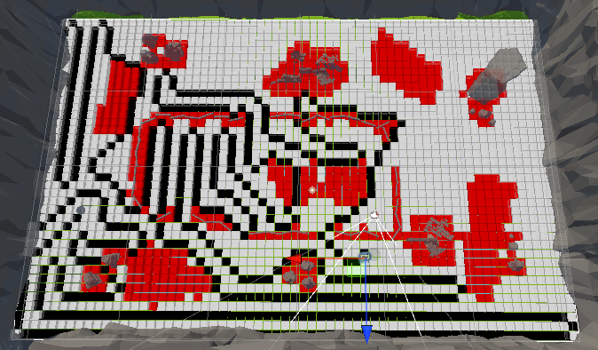
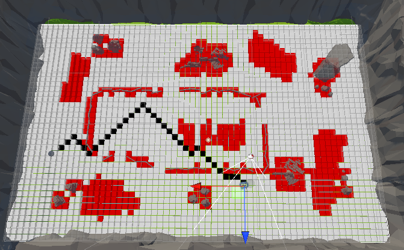
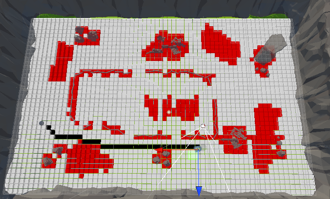

<h1> Happyland </h1>
<h2> Brief Description </h2>

 Happyland will be a tech demo of a boss fight. This shall include build up stages with weaker enemies, to then build up to a 2/3 stage boss battle! In Happyland all the surroundings look very cute and friendly but... get too close to the cute creatures and things can take a turn for the worse. 

<h2> Design Document </h2>

<h4> Map Layout </h4>

 The map is self contained and has walkable and non-walkable terrain, land and water. I have also added a bridge with multiple exits and large obstacles, this is to see how various pathfinding mechanisms might differ in the environment.

<h4> Player </h4>
The controls for the player are basic WASD keyboard keys as well as "E" and "Q", which will represent a quick attack (quicker, less damage) and a heavy damage attack (longer, more powerful).

<h4> Boid Implementation </h4>

<h4> Enemies </h4>
<h5> Finite State Machine Design For Target Enemy </h5>

<h5> Finite State Machine Design For Mini Bomb </h5>

<h4> Main Boss </h4>

<h2> Weekly Development Log </h2>
<h4> 03/11/2022 </h4>
Created more nodes for the behaviour tree.

<h4> 27/10/2022 </h4>
Implemented costs for enemies traversing water. I also finished the implementation of the mini bomb FSM and fixed a bug to do with the re-entering phase of a state when stack based. Made some revisions worked on the feedback from Carlo, which included getting rid of some redudant code and allowing the state manager to have common states which it could push. Then I changed some code to compare the tag rather than getting the tag and comparing strings. 

<h4> 20/10/2022 </h4>
This week I have been working on pathfinding algorithms and building the Mini Bomb FSM. I have implemented Greedy Best First Search and made the system more modular so the pathfind script can be put on individual enemies and the type of pathfind can be set individually. In addition to this, I have been putting together a basic combat system for the hero, with it's working animations.

<h4> 14/10/2022 </h4>
This week I have implemented a node based grid for pathfinding algorithms within my own game scene. With this knowledge I then implemented AStar, BFS and DFS pathfinding algorithms to use alongside my sensors. For next weeks work my plan is to make this modular so within the inspector you can decide which path finding alorithm agents will use, as well as piecing this together with FSMs. I also need to tweak the node radius so the bridge I created works.

<h3> Depth First Search Example </h3>

<h3> Breadth First Search Example </h3>

<h3> A Star Algorithm Example </h3>

<h4> 07/10/2022 </h4>
This week I have completed the ray bundle and box cast from lab 3. I have moved the state and agent code from labs into my main script folder after making the agent modular and creating additional states. Created 2 branches and pull request to implement the target board and mini bomb separately. Completed the stack based lab and then made the agent and state manager be ab able to handle stack based and non-stack based states. Created a "Re-enter" method for states, so when returning to a state when stack based, there is an option to and finish what it was doing and then go into its "execute" method. In addition to this, I have allowed an agent to specify a time for when it is going back into a state so it can be in that state for a minimum amount of time before being subject to usual checks and going into other states, this is to combat the flipping inbetween states when re-entering them.

<h4> 29/09/2022 </h4>
This week I have excluded the tutorial files from linter as they do not contribute to the final project. I have also made some design documents for 2 enemies that will be in the game, these enemies will have finite state machines. I completed the sphere cast and line cast from lab 3.

<h4> 22/09/2022 </h4>

 This week I have done the initial github setup as well as running through some ideas on paper to get my design document ready. I have also added the linter workflow to help with coding standards. I have imported various assets that I shall use for the environment, player and enemies for the project also. 

