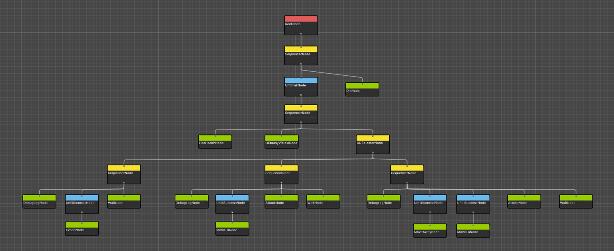

<h1> Happyland </h1>
<h2> Brief Description </h2>

 Happyland will be a tech demo of a boss fight. This shall include build up stages with weaker enemies, to then build up to a 2 stage boss battle! In Happyland all the surroundings look very cute and friendly but... get too close to the cute creatures and things can take a turn for the worse. 

<h2> Back Story </h2>
You are a knight of Happyland and "some evil guy" has captured you in his venture to ruin Happyland with evil creatures! You are held captive in a fort and have to fight waves of enemies to escape into the world and save Happyland. If you escape you be back in Happyland where you can see the beautiful landscape and happy creatures around it!

<h2> Design Document </h2>

<h4> Player </h4>
The controls for the player are basic WASD keyboard keys as well as "E" and "Q", which will represent a quick attack (quicker, less damage) and a heavy damage attack (longer, more powerful).

<h5> Player Controls </h3> 
<ul>
<li>W, A, S, D -> Basic Movement</li>
<li>E -> Heavy Attack</li> 
<li>Q -> Light Attack </li>
<li>Z -> In-Game Debug Interface. </li>
</ul>

<h4> Boid Implementation </h4>
There are two boids, the dragon and the fairy. They are both technologically the same but work on two different node based grids. 

<h4> Enemies </h4>
<h5> Snake Boss </h5>
<h6> The snake boss knows the player's health, if the players health is high then it will either, move to and attack, or pretend to evade but move to and attack. If the player is at low health the boss will look to run away and taunt the player and sometimes attack. </h6>

<h5> Target Enemy </h5>
<h6> The target board will either evade, pretend to evade but then move to and attack or just move to and attack until death. <h6>

<h5> Mini Bomb </h5>
<h6> The mini bomb will go around scaring boids while wandering around. If a boid is in sight then it will scare the boid and then go and traverse back to its original wandering path before wandering around somewhere else. If the bomb sees the player it will move to the position it saw the player first and then explode.

<h4> Map Layout </h4>

 The map is self contained and has walkable and non-walkable terrain, land and water. I have also added a bridge with multiple exits and large obstacles, this is to see how various pathfinding mechanisms might differ in the environment.

<h2> Weekly Development Log </h2>
<h4> 22/12/2022 </h4>
I built my scene, this did require me to add in some "#if UNITY_EDITOR" as it was building editor code when it didn't need to.

<h4> 8/12/2022 </h4>
I trained the ML agents and now have 4 within the outside of the scene working as expected. I also fixes some bugs to do with the mini bomb's wandering mechanic.

<h4> 01/12/2022 </h4>
This week I have implemented a health bar. I have also changed the fairy boid to work on the outside world grid. I have then made an additional boid which is a dragon to go on the "war" grid. I have also started the implementation of the ML agent hummingbird. I have created the scripts and got the training scene ready I just need to create the python file and train.

<h4> 24/11/2022 </h4>
Implemented the wave spawner for the enemies. This currently consists of 3 waves. I then added in a skybox and changed my map checker, to do checks every second rather than every frame. I made and triggered the doors to open once the waves were complete. I also implemented a main menu scene and when the player runs out of health the scene currently restarts. Implemented heap optimisation for A* pathfinding.

<h4> 17/11/2022 </h4>
Created the boss behaviour tree and tweaked collisions so they look more reactive. Designed a game narrative to make the experience more well rounded based on feedback from Carlo, also implemented the collision and wall avoidance as well as the wander steering mechanic based on feedback also. I have created a new NPC, which wanders around the secondary part of the map. 

<h4> 10/11/2022 </h4>
Implemented the steering behaviours seek, flee, evade and arrive. I implemented the scare animation for the bomb. I also implemented a health managed for the enemies and player as well as implemented sounds for attacking of both the player and enemies. I added in nameplates which will show the state of an enemy, it is also toggleable. I made the node grid dynamic at runtime so the map can be changed during the game and the enemies current path will change accordingly.

<h4> 03/11/2022 </h4>
Created more nodes for the behaviour tree - 15 nodes total. Added runtime highlighting for the behaviour tree to show success failure and whether a node is currently running. Nodes can now pass data to one another and types of nodes are highlighted a different colour in the behaviour tree editor view. The undo and redo functions also work in the behaviour tree editor view as well. Implemented the behaviour tree for the Target Board enemy. Still need to implement the actual action for "evade", "die" and "HasHealth" nodes.

<h4> 27/10/2022 </h4>
Implemented costs for enemies traversing water. I also finished the implementation of the mini bomb FSM and fixed a bug to do with the re-entering phase of a state when stack based. Made some revisions worked on the feedback from Carlo, which included getting rid of some redudant code and allowing the state manager to have common states which it could push. Then I changed some code to compare the tag rather than getting the tag and comparing strings. 

<h4> 20/10/2022 </h4>
This week I have been working on pathfinding algorithms and building the Mini Bomb FSM. I have implemented Greedy Best First Search and made the system more modular so the pathfind script can be put on individual enemies and the type of pathfind can be set individually. In addition to this, I have been putting together a basic combat system for the hero, with it's working animations.

<h4> 14/10/2022 </h4>
This week I have implemented a node based grid for pathfinding algorithms within my own game scene. With this knowledge I then implemented AStar, BFS and DFS pathfinding algorithms to use alongside my sensors. For next weeks work my plan is to make this modular so within the inspector you can decide which path finding alorithm agents will use, as well as piecing this together with FSMs. I also need to tweak the node radius so the bridge I created works.

<h3> Depth First Search Example </h3>

<h3> Breadth First Search Example </h3>

<h3> A Star Algorithm Example </h3>

<h4> 07/10/2022 </h4>
This week I have completed the ray bundle and box cast from lab 3. I have moved the state and agent code from labs into my main script folder after making the agent modular and creating additional states. Created 2 branches and pull request to implement the target board and mini bomb separately. Completed the stack based lab and then made the agent and state manager be ab able to handle stack based and non-stack based states. Created a "Re-enter" method for states, so when returning to a state when stack based, there is an option to and finish what it was doing and then go into its "execute" method. In addition to this, I have allowed an agent to specify a time for when it is going back into a state so it can be in that state for a minimum amount of time before being subject to usual checks and going into other states, this is to combat the flipping inbetween states when re-entering them.

<h4> 29/09/2022 </h4>
This week I have excluded the tutorial files from linter as they do not contribute to the final project. I have also made some design documents for 2 enemies that will be in the game, these enemies will have finite state machines. I completed the sphere cast and line cast from lab 3.

<h4> 22/09/2022 </h4>

 This week I have done the initial github setup as well as running through some ideas on paper to get my design document ready. I have also added the linter workflow to help with coding standards. I have imported various assets that I shall use for the environment, player and enemies for the project also. 

<h2> References </h2>
<ul>
<li>Eretichable (no date) Cartoon Explosion Boom Weapons Gun VFX: VFX particles, Unity Asset Store. Available at: https://assetstore.unity.com/packages/vfx/particles/cartoon-explosion-boom-weapons-gun-vfx-229740 (Accessed: November 7, 2022).  </li>
<li>Johnson, J. (no date) Sound manager - audio, sound and music manager for unity: Audio, Unity Asset Store. Available at: https://assetstore.unity.com/packages/tools/audio/sound-manager-audio-sound-and-music-manager-for-unity-56087 (Accessed: November 15, 2022).  </li>
<li>Studios, M (no date) Meshtint Free Chicken mega toon series: 3D animals Unity Asset Store. Available at: https://assetstore.unity.com/packages/3d/characters/animals/meshtint-free-chicken-mega-toon-series-151842 (Accessed: November 17, 2022) </li>
<li>Studios, M. (no date) Meshtint Free Knight: Characters, Unity Asset Store. Available at: https://assetstore.unity.com/packages/3d/characters/humanoids/fantasy/meshtint-free-knight-133286 (Accessed: September 22, 2022).  </li>
<li>Studios, M. (no date) Meshtint Free Tile Map Mega Toon Series: 3D environments, Unity Asset Store. Available at: https://assetstore.unity.com/packages/3d/environments/meshtint-free-tile-map-mega-toon-series-153619 (Accessed: September 22, 2022). </li>
<li>Studios, M. (no date) Monsters ultimate pack 02 cute series: 3D creatures, Unity Asset Store. Available at: https://assetstore.unity.com/packages/3d/characters/creatures/monsters-ultimate-pack-02-cute-series-179083 (Accessed: September 22, 2022). </li>
<li>Studios, S (no date) Polygon dungeons - low poly 3D art by Synty: 3D dungeons Unity Asset Store. Available at: https://assetstore.unity.com/packages/3d/environments/dungeons/polygon-dungeons-low-poly-3d-art-by-synty-102677 (Accessed: September 22, 2022).  </li>
</ul>
